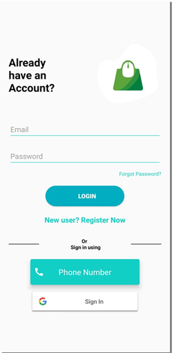
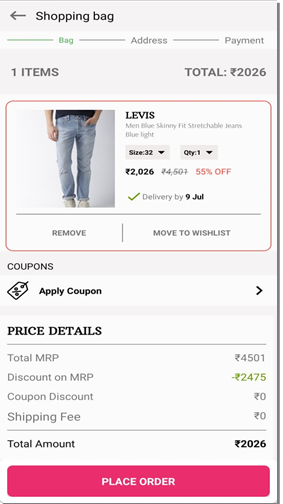

# E-Commerce-App
E Commerce App using Firebase

Couldnt upload all project files
Find all files and place properly in your projects

Download project and connect your Firebase account with Firebase

##Replace your Razorpay key in Android Manifest
<meta-data
            android:name="com.razorpay.ApiKey"
            android:value="YOUR_KEY" />

<h3><b>LOGIN PAGE</b></h3>

<h3><b>SCREENSHOTS</b></h3>

